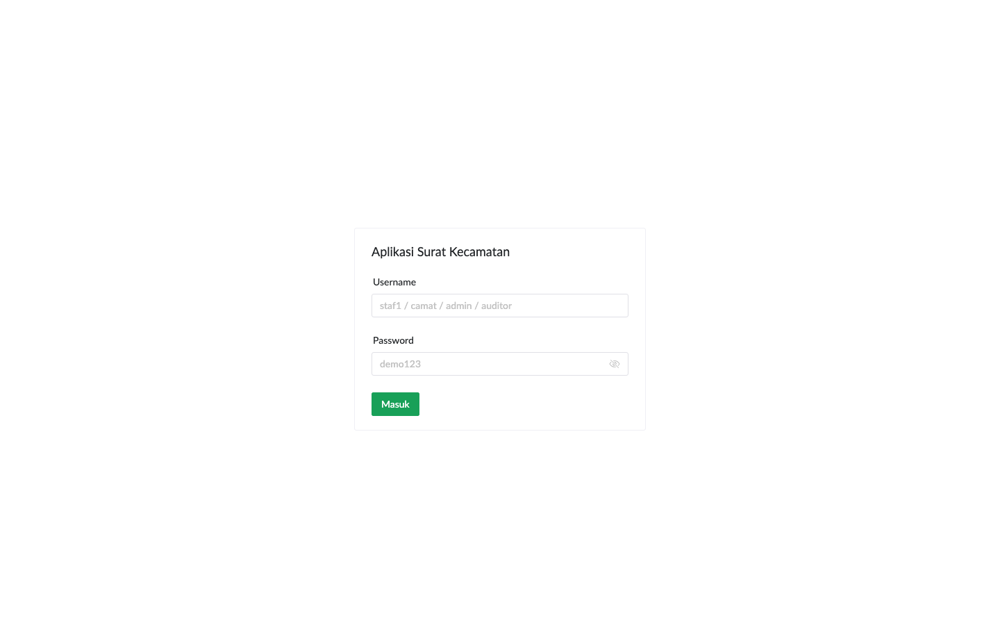
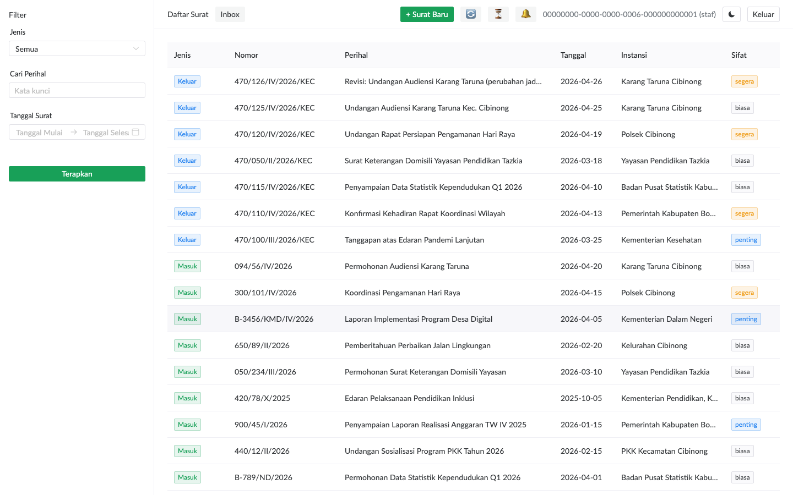
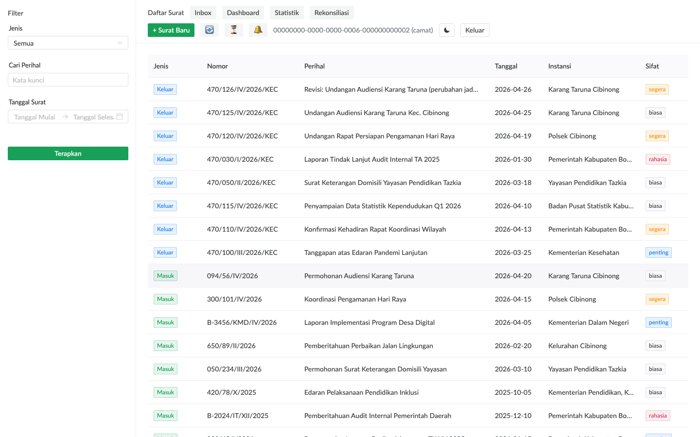
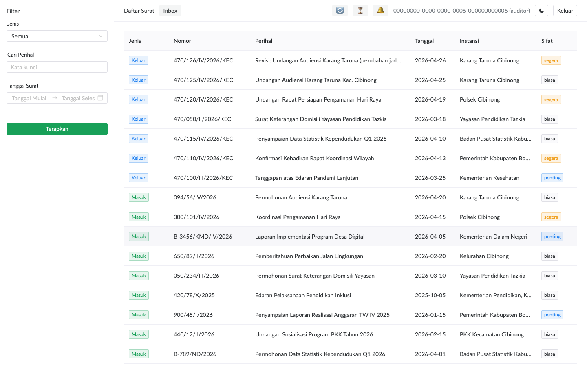

# Pengenalan & Login

## Cara Login

Buka URL aplikasi di browser. Halaman pertama yang muncul adalah form login.

Isi:
- **Username**: salah satu dari `staf1`, `staf2`, `camat`, `admin`, `auditor`, atau `student` (di instance demo).
- **Password**: `demo123` di instance demo. Di production, password ditentukan administrator.

Klik **Masuk**. Sistem akan redirect ke halaman daftar surat kalau kredensial benar.

> **Tips**: Token login berlaku 7 hari. Anda tidak perlu login ulang setiap hari kerja, kecuali browser dibersihkan atau Anda klik **Keluar**.

## Mengenali Role Anda

Tampilan aplikasi berbeda tergantung role:

### Staf

Yang bisa staf lakukan:
- Lihat & cari daftar surat
- Input surat baru (masuk/keluar)
- Edit metadata surat
- Tambah lampiran, tembusan, referensi, komentar
- Tindak lanjut disposisi yang ditugaskan ke dirinya (lihat **Inbox**)

### Camat

Tambahan dibandingkan staf:
- Tombol **Dashboard**, **Statistik**, **Rekonsiliasi** muncul di topbar
- Bisa lihat surat dengan akses level `secret`
- Bisa assign disposisi ke staf
- Resolve antrian rekonsiliasi duplikat

### Auditor

Read-only view:
- Tombol **+ Surat Baru** tidak ada
- Di halaman detail surat, tombol **Edit / Hapus / Tambah** disembunyikan
- Tujuan: pemeriksa eksternal/internal yang butuh akses baca tanpa risiko mengubah data

> **Catatan**: Auditor TIDAK bisa lihat surat dengan akses `secret`. Kalau audit butuh akses ke surat rahasia, koordinasi dengan camat untuk download manual.

## Topbar: Tombol-tombol yang Selalu Tersedia

| Ikon | Fungsi | Kapan dipakai |
|---|---|---|
| 🔄 Sync | Manual sync semua kanal sekaligus (notifikasi, write queue, snapshot) | Saat butuh refresh segera tanpa nunggu polling 30 detik |
| ⏳ Pending | Counter perubahan offline yang belum tersinkron | Saat habis bekerja offline, lihat status sinkronisasi |
| 🔔 Notifikasi | Disposisi baru, komentar baru di surat yang Anda assign | Pop-up otomatis poll setiap 30s |
| ☾ / ☀ | Toggle tema gelap/terang | Preferensi visual |
| Keluar | Logout, hapus token | Akhir hari kerja di komputer shared |

## Cara Logout

Klik tombol **Keluar** di topbar. Token + cache lokal (offline data) akan dihapus.

> **Penting**: Selalu logout di komputer shared (mis. komputer kantor yang dipakai banyak orang) supaya data Anda tidak terbaca user berikutnya.
