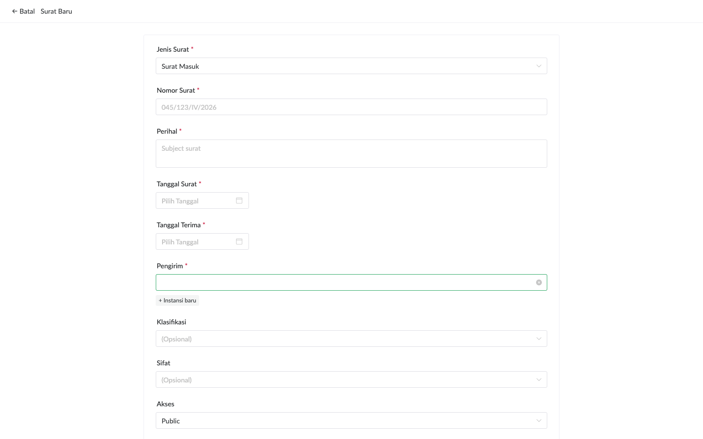
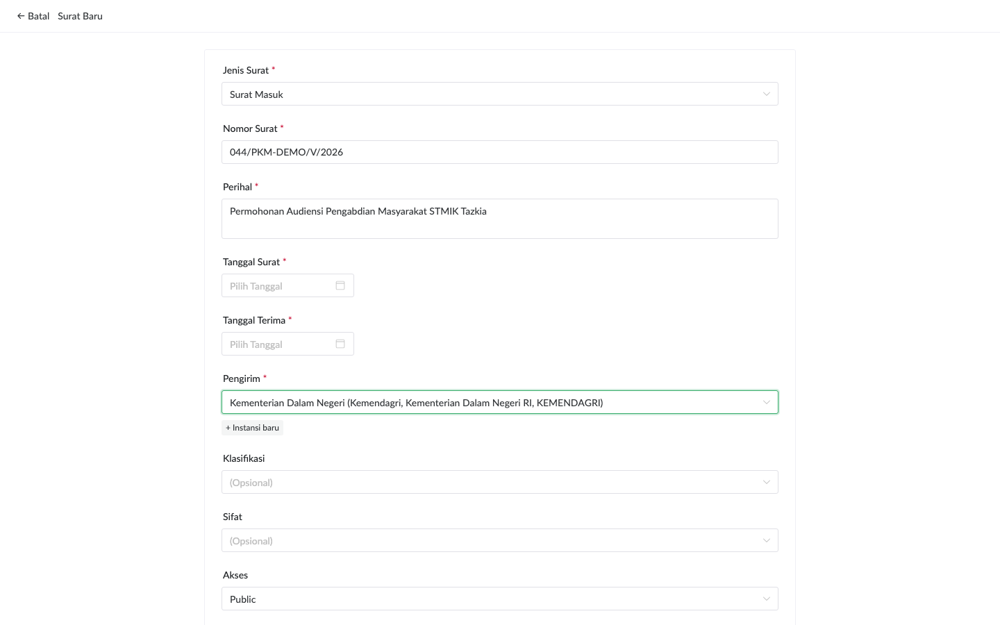
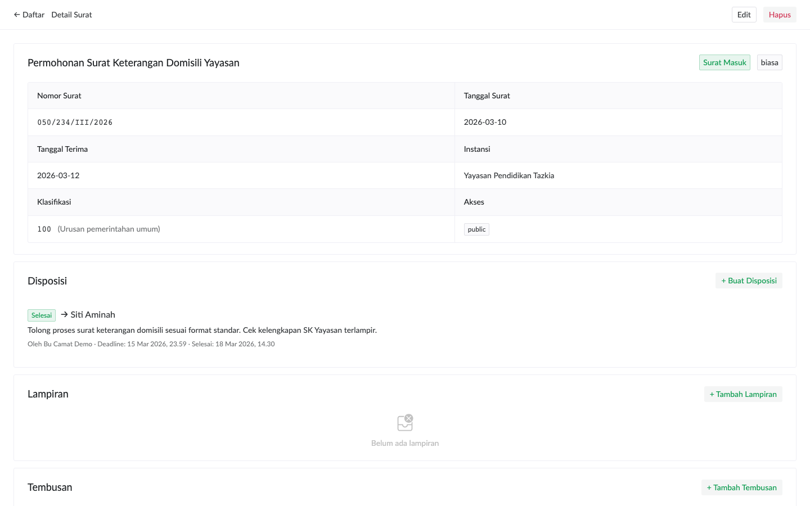
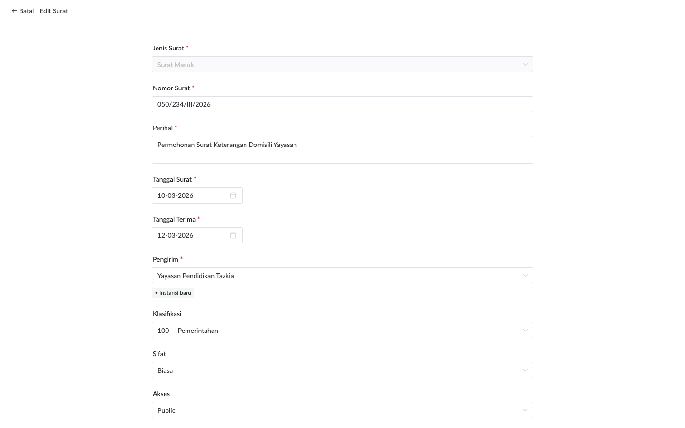

# Input & Edit Surat

Bagian ini menjelaskan workflow utama staf: mencatat surat masuk dan surat keluar.

## Konsep Surat Masuk vs Surat Keluar

| Aspek | Surat Masuk | Surat Keluar |
|---|---|---|
| Sumber nomor | Dari pengirim eksternal | Dari aplikasi pemerintah (penomoran resmi) |
| Tanggal Surat | Tanggal surat asli dari pengirim | Tanggal terbit dari aplikasi pemerintah |
| Tanggal Terima | **Wajib**, kapan kantor menerima | Tidak ada |
| Unique constraint | Per `(instansi, nomor, tanggal_terima)` | `nomor_surat` unique global |
| Workflow | Pencatatan → Disposisi → Tindak lanjut | Buat di aplikasi pemerintah → Download PDF → Input metadata di aplikasi ini |

> **Penting**: Aplikasi ini TIDAK menggenerate nomor surat keluar. Penomoran dilakukan di aplikasi pemerintah pusat. Aplikasi ini hanya mengarsipkan PDF + metadata.

## Input Surat Baru

### Buka Form

Dari halaman daftar surat, klik tombol **+ Surat Baru** di topbar.

### Isi Field Wajib

1. **Jenis**: pilih `Surat Masuk` atau `Surat Keluar`. Field yang tampil di bawah berubah sesuai pilihan.
2. **Nomor Surat**: tulis sesuai format pengirim (mis. `045/123/IV/2026`).
3. **Perihal**: ringkasan isi surat (subject). Akan menjadi judul di list view.
4. **Tanggal Surat**: tanggal surat dari pengirim. Klik input → kalender muncul → pilih tanggal.
5. **Tanggal Terima** (hanya surat masuk): kapan kantor menerima fisik/digital surat.
6. **Instansi**: ketik nama instansi → autocomplete akan saran. Pilih dari dropdown.
7. **Klasifikasi & Sifat** (opsional): pilih dari dropdown.
8. **Akses**: `public` (default) / `restricted` / `secret`.

### Upload Lampiran (Opsional)

Di section **Lampiran**:
- **PDF Utama**: upload satu file PDF resmi (mis. surat asli yang di-scan). Boleh kosong kalau belum ada PDF saat input.
- **Lampiran Tambahan**: drag-and-drop atau klik untuk pilih multiple file. Format yang didukung: PDF, gambar (JPG/PNG), dokumen (DOCX/XLSX), text.

> **Batas ukuran**: 25MB per file. File yang lebih besar akan di-reject oleh server.

### Submit

Klik **Buat Surat**. Aplikasi akan:
1. Insert metadata ke database
2. Stream upload file ke storage
3. Auto-detect dedup tuple (untuk surat masuk) — kalau ada surat lain dengan kombinasi yang sama, masuk antrian rekonsiliasi
4. Redirect ke halaman detail

## Halaman Detail Surat

Setelah submit, Anda lihat halaman detail dengan semua informasi terstruktur:

Section yang tersedia:
- **Header**: perihal, jenis, sifat, akses level, tanggal-tanggal, instansi
- **Disposisi**: assignment ke staf (kalau ada)
- **Lampiran**: file PDF + metadata, tombol Preview/Unduh/Replace/Versi
- **Tembusan**: copy distribution ke instansi/kontak lain
- **Riwayat Korespondensi**: surat lain yang merujuk atau dirujuk surat ini
- **Komentar**: thread diskusi append-only

## Edit Surat

Dari halaman detail, klik tombol **Edit** di pojok kanan atas. Form muncul terisi dengan data existing.

Yang **bisa** diedit:
- Perihal, tanggal, klasifikasi, sifat, akses level, instansi
- Nomor surat (untuk surat masuk; surat keluar terikat unique constraint)

Yang **tidak bisa** diedit:
- Jenis (masuk/keluar) — terkunci setelah create
- ID surat (otomatis di-generate)

Klik **Simpan Perubahan**. Sistem akan:
1. Update metadata
2. Audit log entry baru (siapa edit apa, kapan)
3. **Bila offline**: simpan ke queue lokal, sync saat online

> **Penting bila edit offline**: Anda akan melihat toast "Tersimpan offline — akan sync saat online". Perubahan ada di komputer Anda saja sampai koneksi kembali. Lihat indikator ⏳ di topbar untuk status pending sync.

## Hapus Surat

Dari halaman detail, klik tombol **Hapus** lalu konfirmasi di popup.

> **Soft delete**: surat tidak terhapus permanen — hanya ditandai dihapus. Administrator bisa restore kalau perlu (lihat panduan administrator).

## Tambah Lampiran Setelah Surat Dibuat

Kalau surat sudah ter-input tapi PDF baru tersedia kemudian:
1. Buka detail surat
2. Di section **Lampiran**, klik **+ Tambah Lampiran**
3. Pilih role (PDF Utama / Lampiran), upload file
4. Klik **Upload**

Lampiran baru langsung muncul di list dan teks PDF di-extract untuk full-text search.

## Replace Lampiran (Versi Baru)

Kalau ada revisi PDF:
1. Di list lampiran, klik **Replace** pada file yang akan diupdate
2. Upload versi baru
3. Versi lama otomatis tersimpan di chain history (linked-list)
4. Klik **Versi** untuk lihat semua versi historis

> **Audit trail**: Versi lama TIDAK terhapus — tetap bisa diakses untuk audit. Tag "Aktif" menunjukkan versi terkini.

## Pencarian Surat

Di halaman daftar, gunakan field **Kata kunci**. Pencarian sekarang adalah **full-text** — match keyword di:
- Perihal
- Nomor surat
- Konten teks dari PDF lampiran (untuk PDF born-digital, bukan scan)

Filter tambahan:
- **Jenis**: masuk / keluar / semua
- **Tanggal**: range from-to

Klik **Terapkan**.

> **Limitasi**: PDF hasil scan tanpa text layer tidak akan ter-index. Untuk OCR scan, lihat roadmap "Further Improvement".
