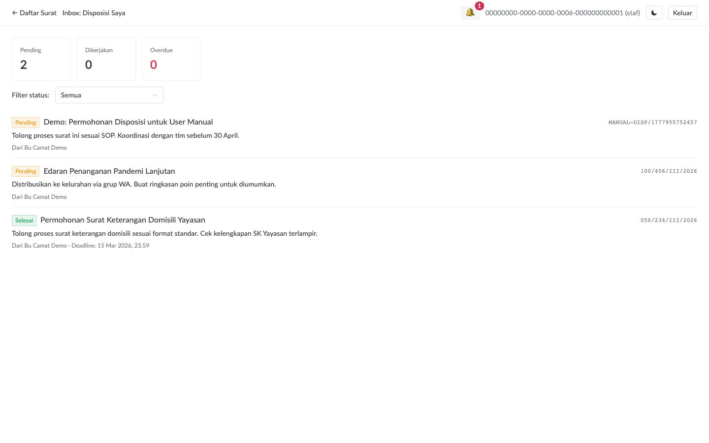
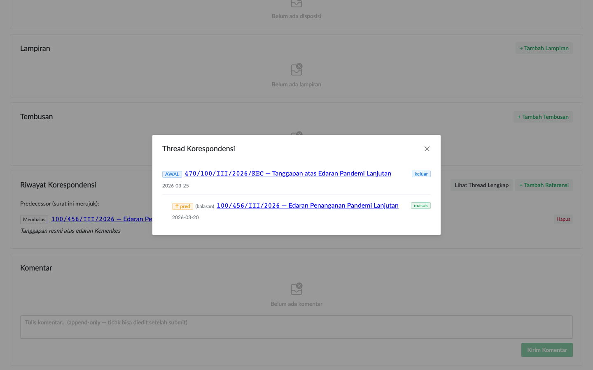

# Tindak Lanjut Disposisi

Camat akan assign disposisi ke Anda lewat detail surat. Bagian ini menjelaskan workflow staf saat menerima dan memproses disposisi.

## Notifikasi Disposisi Baru

Saat camat assign disposisi baru ke Anda, Anda dapat notifikasi via:

1. **Bell topbar 🔔**: badge angka muncul, dropdown berisi link ke surat
2. **Inbox view** (`/inbox`): list semua disposisi mine, filter status

Kalau bell badge tidak terlihat update segera, klik tombol **🔄 Sync** untuk refresh manual (default polling 30 detik).

## Buka Inbox

Klik tombol **Inbox** di topbar. Daftar disposisi yang ditugaskan ke Anda muncul, dengan summary stat di atas:

- **Pending**: belum dimulai
- **Dikerjakan**: sudah klik "Mulai", masih dalam progress
- **Overdue**: deadline terlewat (warna merah)

Filter dropdown di atas untuk fokus ke status tertentu.

## Mulai Mengerjakan Disposisi

1. Klik salah satu item di Inbox → navigate ke detail surat
2. Di section **Disposisi**, klik tombol **Mulai** pada item yang ditugaskan ke Anda
3. Status berubah menjadi `Sedang dikerjakan`
4. Camat dan creator notifikasi otomatis tentang progress

## Komunikasi via Komentar

Selama mengerjakan, gunakan section **Komentar** di halaman detail surat untuk update progress, tanya konfirmasi, atau koordinasi.

Komentar bersifat **append-only** — sekali submit tidak bisa di-edit/hapus. Kalau salah ketik, post komentar koreksi baru.

> **Audit by construction**: append-only adalah pilihan desain. Semua diskusi tercatat, audit lengkap tanpa konfigurasi tambahan.

## Tandai Selesai

Setelah pekerjaan rampung:
1. Klik tombol **Selesai** pada item disposisi
2. Status berubah jadi `Selesai`, `completed_at` ter-set otomatis
3. Camat dapat notifikasi penyelesaian

## Membatalkan Disposisi

Kalau ternyata bukan tanggung jawab Anda, atau ada perubahan rencana:
1. Klik **Batal** pada item disposisi
2. Status `Dibatalkan` — non-final, audit log mencatat siapa & kapan

Camat dan creator otomatis tahu via notifikasi.

> **Tips**: Sebelum klik Batal, lebih baik post komentar di thread surat untuk menjelaskan alasan, supaya camat paham konteks.

## Lihat Riwayat Korespondensi

Beberapa surat memiliki **predecessor** (surat sebelumnya yang ini balas) atau **successor** (surat berikutnya yang merujuk ini). Section **Riwayat Korespondensi** menampilkan keduanya.

Klik tombol **Lihat Thread Lengkap** untuk modal yang menampilkan transitive thread (chain multi-level):

Berguna saat menangani surat balasan kompleks yang melibatkan beberapa instansi dan periode waktu.

## Kalau Pekerjaan Lupa Selesai

Kalau Anda lupa klik Selesai, deadline akan terlewat dan status `overdue` akan terlihat di:
- Indicator badge merah di Inbox
- Camat dashboard akan menampilkan jumlah overdue

Camat berhak override status disposisi (misal mark sebagai `cancelled` kalau sudah tidak relevan, atau update instruksi).

## Workflow Khas Hari Kerja

1. **Pagi**: login → cek 🔔 + Inbox → lihat disposisi baru
2. **Selama hari**: kerjakan disposisi sesuai prioritas (sifat `segera` > `penting` > `biasa`)
3. **Akhir tugas**: klik Selesai pada disposisi yang rampung
4. **Sore**: kalau ada surat masuk fisik baru, input via **+ Surat Baru**
5. **Habis kerja offline**: pastikan sync ⏳ tidak ada pending sebelum tutup browser
