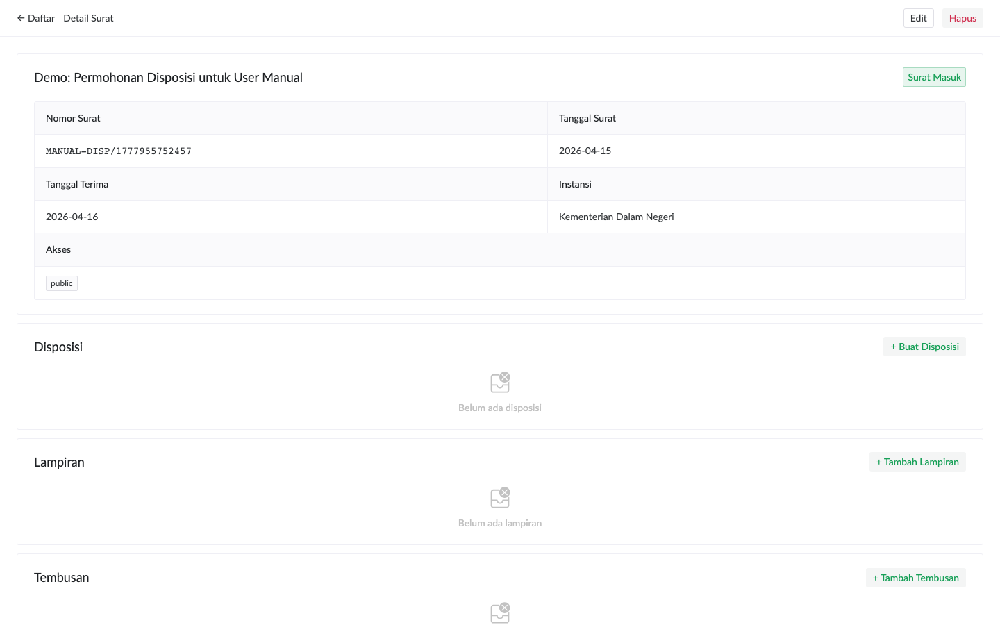
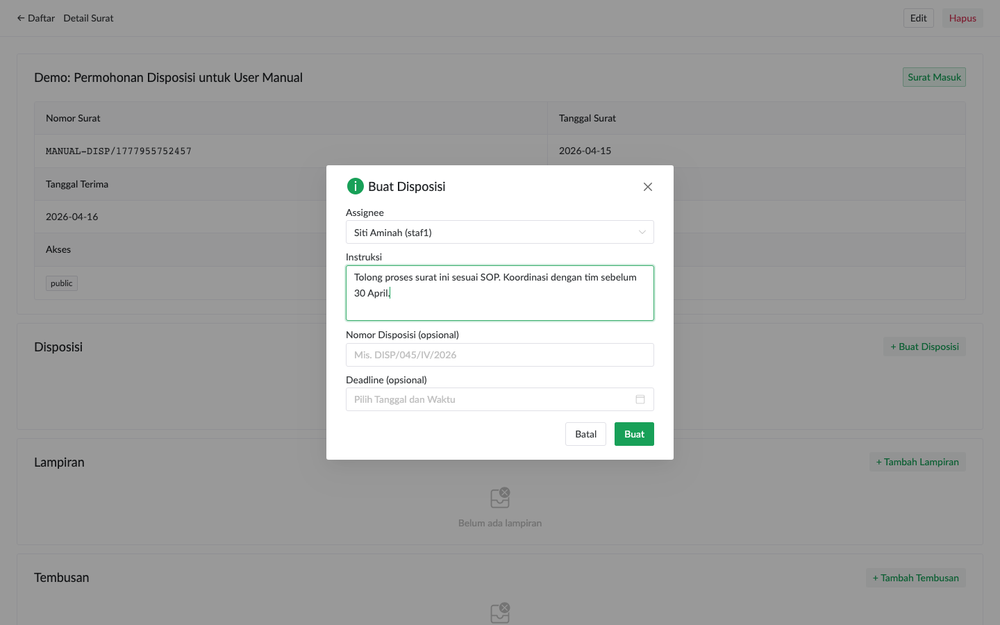
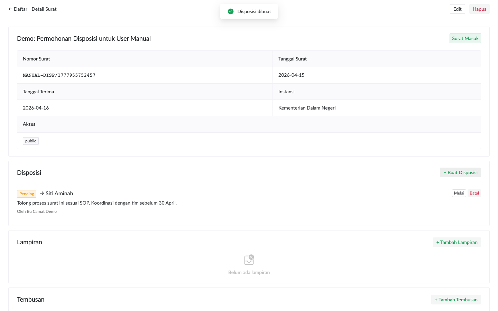

# Supervisi & Disposisi (Camat)

Camat berperan sebagai supervisor: review surat masuk, assign tindak lanjut ke staf, monitor progress, dan menyelesaikan kasus rekonsiliasi duplikat.

## Membuat Disposisi Baru

Buka detail surat masuk yang perlu didisposisikan. Section **Disposisi** ada di atas (setelah header).

Klik **+ Buat Disposisi**. Dialog muncul dengan field:

- **Assignee**: dropdown user staf/camat yang aktif. Filterable — ketik nama untuk cari.
- **Instruksi**: instruksi konkret untuk assignee. Lebih spesifik = lebih baik (mis. "Buat draft surat balasan, kirim ke saya untuk review sebelum 25 April").
- **Nomor Disposisi** (opsional): nomor formal kalau kantor pakai sistem agenda manual.
- **Deadline** (opsional): klik input → pilih tanggal + jam dari kalender datetime.

Klik **Buat**. Disposisi muncul di list, dan assignee dapat notifikasi otomatis.

## Self-Assign

Anda bisa pilih `Bu Camat` (diri sendiri) sebagai assignee — berguna saat:
- Surat butuh handle pribadi camat (mis. koordinasi dengan kepala dinas)
- Camat ingin menandai "saya akan tindak lanjuti" tanpa melibatkan staf

Notifikasi tidak terkirim ke diri sendiri (skip self-notification).

## Override Status Disposisi

Camat punya wewenang override status disposisi siapapun, tidak hanya yang Anda buat sendiri:
- **Mark cancelled** — kalau pekerjaan tidak relevan lagi
- **Mark done** — kalau staf lupa klik selesai padahal pekerjaan sudah rampung
- **Edit instruksi** — kalau perlu klarifikasi tambahan

Klik tombol aksi yang tampil di item disposisi.

## Komentar Diskusi Multi-User

Section **Komentar** di detail surat berfungsi sebagai mini-forum diskusi. Semua participant (camat, assignee, creator) bisa post.

Append-only — tidak bisa edit/hapus. Audit log built-in.

> **Tips komunikasi**: pakai komentar daripada email/WA untuk diskusi seputar surat. Semua tercatat di tempat yang sama, future-Anda berterima kasih saat audit.

## Workflow Khas Camat

1. **Pagi**: review **Dashboard** → fokus pada "Belum Diassign" + "Overdue" 
2. **Disposisi batch**: buka surat masuk hari ini, assign ke staf yang tepat
3. **Review komentar**: dari notifikasi atau detail surat
4. **Akhir minggu**: cek **Statistik** → beban staf, distribusi instansi pengirim, tren bulanan
5. **Bulanan**: handle **Rekonsiliasi** queue (kalau ada duplikat dari periode offline)

## Akses Surat Rahasia

Surat dengan akses level `secret` hanya tampil ke role camat dan admin. Staf tidak akan melihatnya di list maupun detail.

Saat download/preview PDF surat dengan akses `restricted` atau `secret`, file otomatis di-watermark dengan nama camat + timestamp diagonal di setiap halaman. Untuk audit trail forensik kalau PDF di-screenshot atau di-print bocor.
