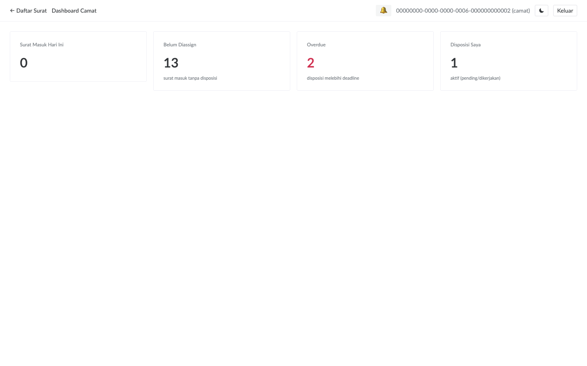
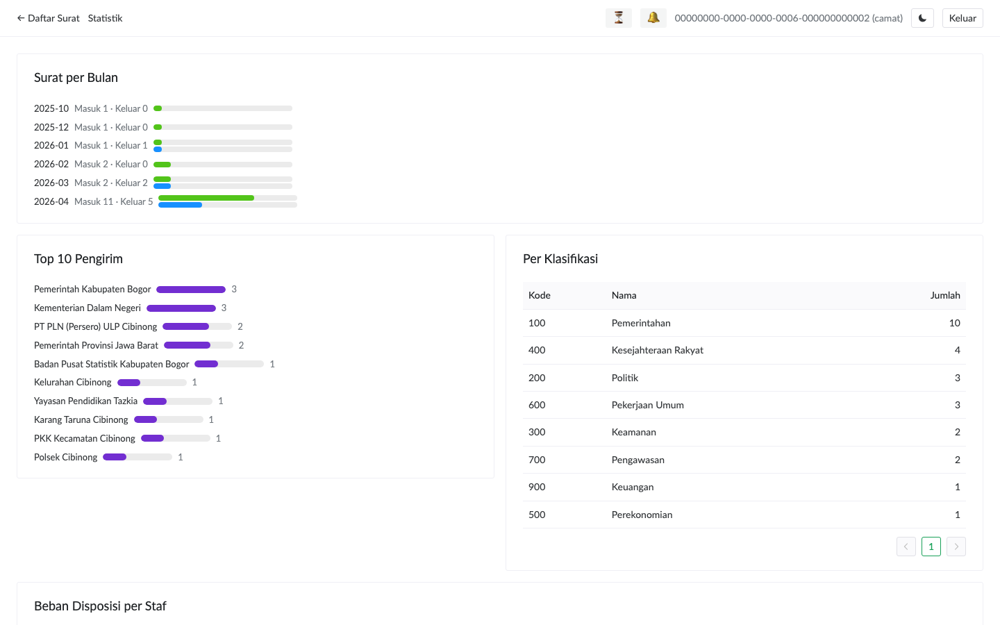

# Dashboard & Statistik

Dua halaman ringkasan untuk camat: **Dashboard** (operasional hari ini) dan **Statistik** (analisis periodik).

## Dashboard Camat

Klik tombol **Dashboard** di topbar. Empat kartu ringkas muncul:

| Kartu | Hitungan | Aksi klik |
|---|---|---|
| **Surat Masuk Hari Ini** | Surat masuk dengan `tanggal_terima = hari ini` | Buka daftar surat |
| **Belum Diassign** | Surat masuk yang belum punya disposisi sama sekali | Buka daftar surat (filter manual) |
| **Overdue** | Disposisi pending/dikerjakan dengan deadline < sekarang | Buka **Inbox** |
| **Disposisi Saya** | Disposisi yang ditugaskan ke camat (self) yang aktif | Buka **Inbox** |

Refresh manual: klik tombol **🔄 Sync** di topbar — angka akan update.

> **Tips**: Buka dashboard pertama kali setiap pagi. Fokus prioritas:
> 1. **Overdue** (warna merah) — yang sudah lewat deadline butuh follow-up
> 2. **Belum Diassign** — surat hari ini yang perlu didisposisikan
> 3. **Disposisi Saya** — pekerjaan camat sendiri

## Halaman Statistik

Klik tombol **Statistik** di topbar untuk laporan periodik:

Empat panel:

### 1. Surat per Bulan

Time series count surat masuk (hijau) + keluar (biru) per bulan, dari Januari sampai bulan saat ini.

Berguna untuk:
- Validasi tren beban kerja (bulan tertentu memuncak)
- Verifikasi konsistensi penomoran (skip nomor di bulan tertentu)

### 2. Top 10 Pengirim

Instansi pengirim surat masuk terbanyak (descending). Bar visual dengan count di kanan.

Berguna untuk:
- Identifikasi instansi yang sering korespondensi (siapkan template balasan)
- Audit kalau ada instansi yang tiba-tiba kirim banyak surat

### 3. Per Klasifikasi

Tabel COUNT GROUP BY klasifikasi (Kepegawaian, Keuangan, Umum, dll.).

Berguna untuk:
- Audit distribusi topik
- Validasi staf alokasi (kalau klasifikasi Kepegawaian dominan, alokasi staf HR perlu)

### 4. Beban Disposisi per Staf

Tabel per-staf:
- **Aktif**: pending + sedang dikerjakan
- **Overdue**: deadline lewat (warna merah)
- **Selesai**: total kumulatif

Berguna untuk:
- Identifikasi staf yang overload (bantuan distribusi ulang)
- Identifikasi staf yang under-utilized
- Performance review periodik

> **Note**: Statistik mencakup SEMUA periode (bukan filter tanggal). Future Improvement: filter per range, per staf, per klasifikasi.

## Akses Role

Dashboard + Statistik hanya tersedia untuk role **camat** dan **admin**. Staf tidak akan melihat tombol di topbar.

Akses langsung URL `/dashboard` atau `/stats` oleh staf akan redirect ke `/surat`.
