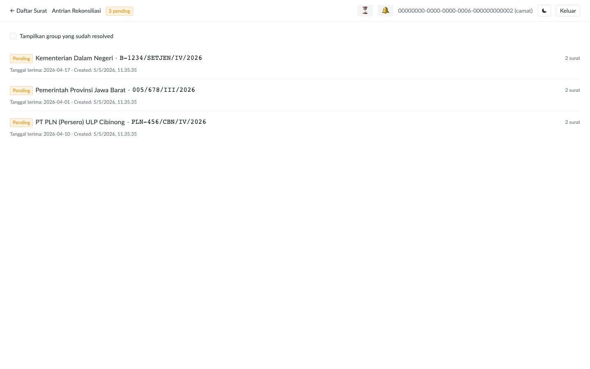
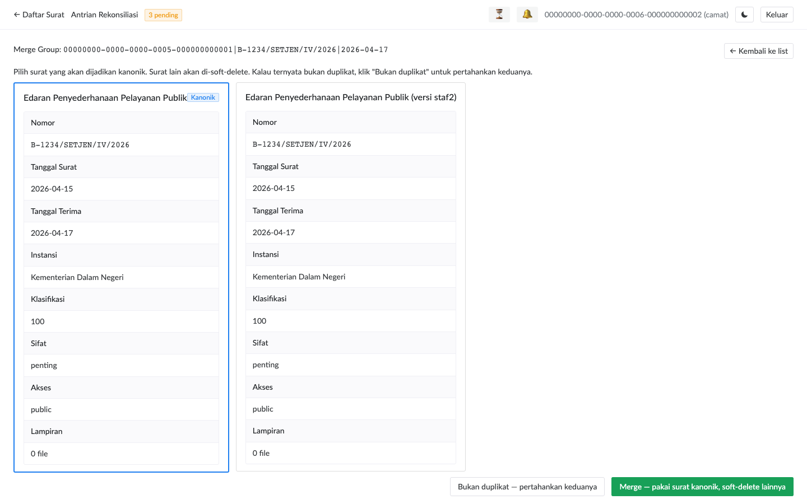

# Rekonsiliasi Duplikat

Kasus duplikat terjadi saat **dua staf input surat yang sama dalam window offline**. Setelah keduanya online dan sync, server mendeteksi dan masuk antrian rekonsiliasi.

## Kapan Sistem Mendeteksi Duplikat

Untuk **surat masuk**: server cek tuple `(instansi_id, nomor_surat, tanggal_terima)`. Kalau dua surat masuk punya kombinasi ini sama, masuk antrian.

Untuk **surat keluar**: tidak ada antrian — `nomor_surat` sudah unique constraint global. Insert kedua otomatis ditolak dengan error `Nomor surat sudah dipakai`.

> **Mengapa tidak auto-reject surat masuk**: konteks offline → kalau staf ke-2 di-tolak, perubahan di laptop dia akan hilang. Lebih aman: simpan keduanya, biar camat decide siapa yang kanonik.

## Akses Antrian

Klik tombol **Rekonsiliasi** di topbar (camat-only).

Setiap entry adalah satu **group**:
- Tag status: `Pending` (perlu resolve), `Sudah di-merge`, `Disimpan kedua`
- Instansi pengirim + nomor surat (kunci dedup)
- Tanggal terima
- Count berapa surat di group (biasanya 2; bisa lebih kalau >2 staf input)

Centang checkbox **"Tampilkan group yang sudah resolved"** untuk audit historis.

## Side-by-Side Merge

Klik salah satu group → halaman detail merge muncul:

Setiap surat ditampilkan sebagai card terpisah dengan field-by-field comparison. Field yang **berbeda antar surat** ditandai warna kuning untuk visual cue.

Tiga aksi yang tersedia:

### 1. Pilih Kanonik + Merge

Klik card surat yang akan dijadikan **kanonik** (border biru muncul, tag "Kanonik"). Lalu klik tombol **Merge**.

Hasil:
- Surat kanonik tetap aktif
- Surat lain di group **soft-delete** (tidak hilang permanen — admin bisa restore)
- Status group berubah jadi `merged`
- `resolved_at` + `resolved_by` ter-set

> **Tips memilih kanonik**: lihat field yang lebih lengkap — yang punya lebih banyak lampiran, perihal lebih jelas, klasifikasi/sifat ter-set. Field yang missing di kanonik bisa di-edit setelah merge.

### 2. Bukan Duplikat — Pertahankan Keduanya

Klik tombol **Bukan duplikat — pertahankan keduanya**. Konfirmasi via popconfirm.

Hasil:
- Kedua surat tetap aktif
- Status group `kept_both`
- Group hilang dari "pending" list (kecuali Anda centang "include resolved")

Berguna saat: misalnya kebetulan dua instansi berbeda kirim nomor surat sama dengan tanggal sama (rare tapi bisa terjadi karena format nomor tidak terstandarisasi).

### 3. Tidak Resolve Sekarang

Tinggalkan group, klik **← Kembali ke list**. Group tetap di antrian sampai Anda decide nanti.

> **Catatan urutan**: prioritas resolve berdasarkan dampak operasional, bukan first-in-first-out. Kalau ada surat penting di pending group, resolve dulu supaya staf bisa lanjut tindak lanjut.

## Workflow Praktik

1. **Mingguan check**: buka antrian rekonsiliasi setiap Senin pagi, resolve backlog dari minggu sebelumnya
2. **Pasca-disconnection**: kalau ada periode internet kantor down 1-2 hari, ekspektasikan group baru muncul saat reconnect — schedule waktu khusus untuk handle batch
3. **Komunikasi staf**: kalau ada banyak duplikat, koordinasi dengan staf untuk avoid double-input next time (mis. tetapkan zone responsibility per kategori instansi)

## Audit Trail

Decision merge / kept_both tercatat di:
- `reconciliation_queue.resolved_by` + `resolved_at`
- Audit log `surat` (untuk soft-delete loser)
- Surat kanonik tetap accessible dengan history utuh
- Surat loser bisa di-restore admin kalau merge ternyata salah

> **Important**: Audit log adalah satu-satunya sumber resmi. Kalau ada dispute "kenapa surat saya di-merge", lihat audit log untuk detail siapa-kapan-keputusan.
