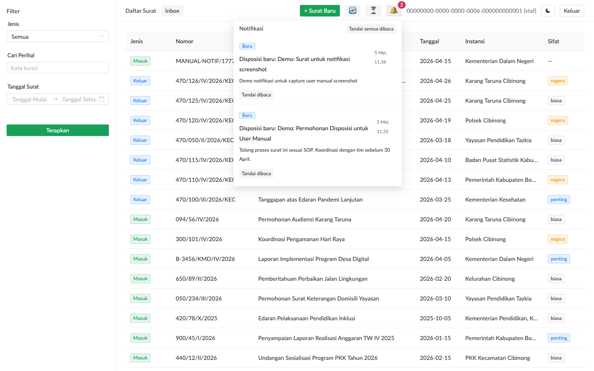
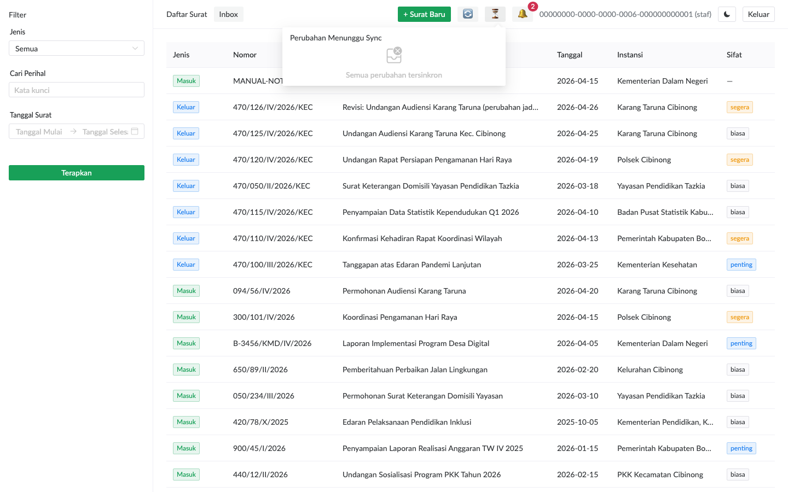
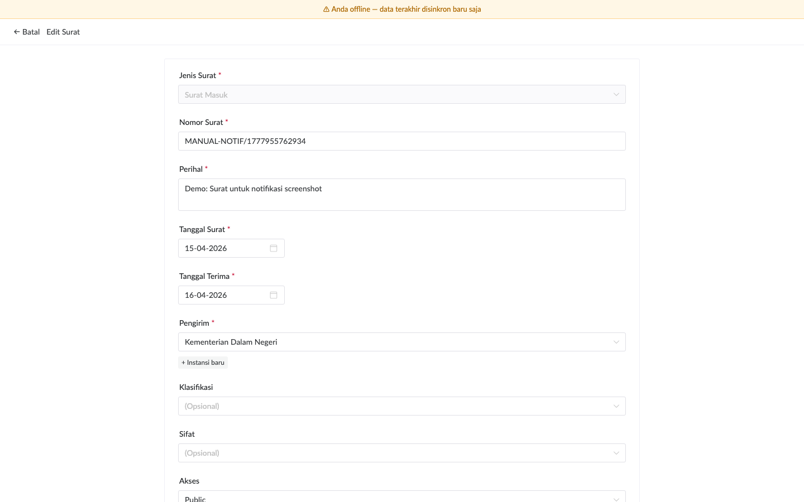

# Notifikasi & Sinkronisasi

## Notifikasi In-App

Tombol bell 🔔 di topbar berfungsi sebagai inbox notifikasi. Badge angka muncul saat ada notif belum dibaca.

### Jenis Notifikasi

| Jenis | Kapan dikirim | Penerima |
|---|---|---|
| **Disposisi baru** | Camat assign disposisi (bukan self-assign) | Assignee |
| **Komentar baru** | Ada user post komentar di surat | Semua participant disposisi (assignee + creator), kecuali poster |

### Aksi di Dropdown

- **Klik item**: navigate ke detail surat, auto mark-as-read
- **Tandai dibaca** (per item): mark single notif read tanpa navigate
- **Tandai semua dibaca**: bulk mark all unread

### Polling 30 Detik

Bell auto-poll setiap 30 detik. Kalau Anda butuh refresh segera (mis. baru selesai diskusi sama camat di Slack), klik tombol **🔄 Sync** di topbar untuk pull immediate.

## Pending Sync Indicator

Tombol ⏳ di topbar menampilkan jumlah **perubahan offline yang belum tersinkron** ke server.

Badge muncul saat:
- Anda edit surat saat offline → tersimpan ke queue lokal
- Network glitch saat submit → operasi ditahan + retry exponential backoff

### Drainer Otomatis

Setiap 30 detik, drainer background akan flush queue ke server kalau koneksi available. Plus auto-trigger saat browser fire `online` event.

### Manual Drain

Kalau Anda butuh sync segera (mis. mau switch komputer):
1. Klik tombol ⏳ untuk buka dropdown
2. Klik **Sync sekarang**

Item akan terkirim batch (max 50 ops per request), dengan retry exponential backoff (1s → 2s → 4s → … cap 60s) kalau gagal.

### Daftar Pending

Dropdown menampilkan list pending ops dengan:
- Tag aksi: `Edit`, `Buat`, `Hapus`, `Komentar`
- Entity type: `Surat`, `Komentar`, dll
- Timestamp client (saat ops dibuat di browser)
- Error message kalau retry sudah pernah gagal (warna merah)

## Sinkronisasi Manual Global

Tombol **🔄 Sync** trigger paralel:

1. **Pull notifikasi terbaru** — replace polling 30s untuk refresh segera
2. **Drain pending write queue** — push perubahan offline ke server
3. **Refresh Dexie metadata snapshot** — update cache lokal untuk surat list view

Toast feedback:
- Sukses: "Sinkronisasi selesai"
- Sebagian gagal: "Sinkronisasi sebagian gagal: [reason]"
- Offline: warning "Tidak bisa sync — sedang offline"

> **Kapan dipakai**: sebelum tutup browser di akhir hari, sebelum/sesudah long offline session, atau saat menunggu hasil camat assign disposisi yang Anda butuhkan segera.

## Indikator Offline

Saat browser detect koneksi terputus, banner kuning muncul di atas page:

Banner menampilkan kapan terakhir sinkron — penting untuk paham seberapa stale data Anda lihat.

### Apa yang Masih Bisa & Tidak Bisa Saat Offline

| Operasi | Saat Offline |
|---|---|
| Lihat daftar surat | ✓ (dari Dexie cache) |
| Lihat detail surat (metadata) | ✓ (kalau sudah di-cache sebelum offline) |
| Lihat PDF lampiran | ✗ (PDF tidak di-cache, tetap online-only) |
| Edit surat | ✓ (masuk pending queue, sync saat online) |
| Buat surat baru | ✗ (butuh server-side dedup check) |
| Tindak lanjut disposisi | ✗ (butuh server interaction) |
| Komentar / disposisi | ✗ (server-side write only) |

> **Rationale**: Operasi yang butuh server-side validation (create dengan dedup check, disposisi yang butuh notify ke user lain, komentar yang merge di multi-user thread) harus online. Edit metadata sederhana yang konflik di-handle row-level LWW boleh offline.

## Skenario Network Tidak Stabil

Saat jaringan kantor putus-nyambung:

1. Banner offline muncul/hilang berulang
2. Pending queue terisi setiap kali Anda submit edit
3. Drainer auto-coba sync setiap 30 detik
4. Retry exponential backoff supaya tidak hammer server saat reconnect

Anda tidak perlu lakukan apa-apa khusus — sistem self-heal. Cukup pastikan **sebelum tutup browser**, badge ⏳ sudah `0` (semua tersinkron).

> **Worst case**: kalau Anda harus tutup browser dengan badge >0, perubahan **TIDAK hilang** — tetap di IndexedDB. Saat login ulang, drainer akan resume sync.
