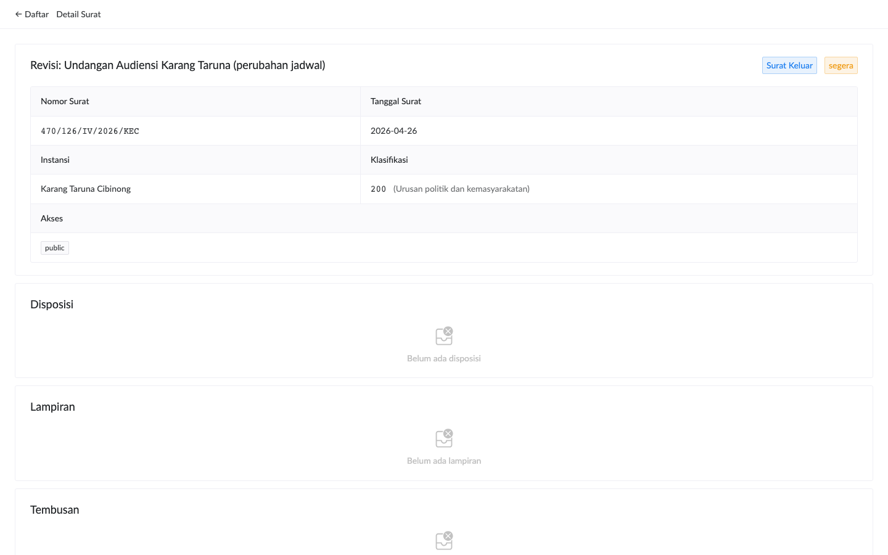

# Auditor (Read-Only)

Role **auditor** dirancang untuk pemeriksa eksternal: inspektorat, BPK, atau internal auditor pemerintah. Akses read-only — tidak bisa mengubah data.

## Login

Username `auditor` (di instance demo). Password dari administrator.

Setelah login, tampilan mirip staf tapi dengan beberapa tombol disembunyikan:

## Yang Bisa Auditor Lakukan

✓ Lihat daftar surat (kecuali yang akses level `secret`)  
✓ Buka detail surat dengan semua metadata  
✓ Download PDF lampiran  
✓ Lihat thread korespondensi (transitive references)  
✓ Lihat versi historis attachment (linked-list chain)  
✓ Lihat disposisi (assignment history) + komentar (audit trail diskusi)  
✓ Lihat tembusan distribution  
✓ Sinkronisasi cache lokal (akses offline read-only juga)

## Yang TIDAK Bisa Auditor Lakukan

✗ Buat surat baru (tombol **+ Surat Baru** disembunyikan)  
✗ Edit/hapus surat (tombol Edit/Hapus disembunyikan)  
✗ Tambah/hapus lampiran, tembusan, referensi  
✗ Tambah komentar (input disembunyikan)  
✗ Buat/update disposisi  
✗ Akses surat dengan akses `secret` (kecuali ditambahkan permission khusus)  
✗ Akses dashboard supervisi atau statistik (camat-only)  
✗ Akses antrian rekonsiliasi (camat-only)

> **Audit etika**: kalau auditor butuh akses ke surat `secret` untuk pemeriksaan, koordinasi dengan camat untuk export/share manual. Dengan begitu camat tetap punya log siapa-akses-apa di catatan administratif.

## Workflow Khas Audit

### 1. Sample Random Audit

Buka daftar surat → filter periode tertentu (mis. Q1 2026) → review beberapa surat sample untuk:
- Kelengkapan metadata (perihal, instansi, klasifikasi)
- Kebenaran penomoran (terutama surat keluar yang harus unique)
- Komentar diskusi (apakah ada keputusan yang perlu di-review)
- Disposisi history (apakah workflow standar dipatuhi)

### 2. Audit Tematik

Misal audit kepatuhan perihal "Pengadaan Barang/Jasa":
- Search keyword "pengadaan" di field search
- Buka satu-satu surat hasil
- Verify lampiran lengkap, tembusan ke pihak yang seharusnya
- Trace thread korespondensi (mis. dari permohonan → balasan → tindak lanjut)

### 3. Audit Performa

Tidak punya akses statistik agregat. Kalau auditor butuh laporan agregat (mis. jumlah surat per instansi tahun lalu), request ke camat untuk export atau screenshot dashboard.

### 4. Audit Forensik (Specific Incident)

Kalau ada dispute "kapan surat X di-edit?" atau "siapa yang setujui disposisi Y?":
- Buka detail surat
- Komentar thread berisi diskusi historis (append-only — tidak bisa di-edit)
- **Audit log** (tabel `audit_log` di database) catat semua perubahan dengan timestamp + user — akses via DBA atau admin (auditor tidak punya akses langsung)

> **Important**: Komentar thread + audit log adalah **legally relevant**. Append-only by construction — tidak bisa di-edit/hapus dari UI. Konfirmasi dengan IT/admin kalau perlu raw data export untuk laporan formal.

## Pelaporan Audit

Aplikasi **tidak** menyediakan tombol export hasil audit. Auditor copy-paste atau screenshot manual. Future Improvement: export CSV/XLSX hasil filter (lihat ROADMAP).

## Sesi Audit Berakhir

Klik **Keluar**. Cache lokal Anda akan dihapus — penting kalau Anda akses dari komputer kantor yang dipakai bergantian.
