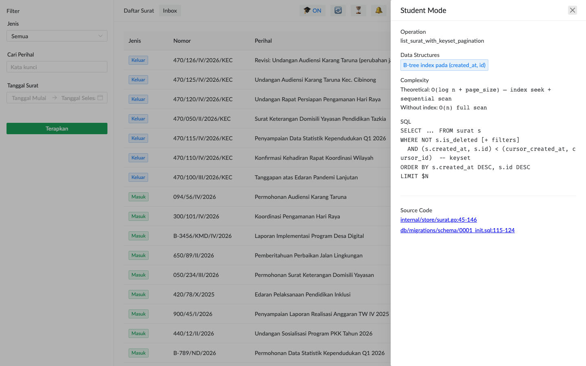

# Student Mode (Mahasiswa)

Aplikasi ini adalah project PkM STMIK Tazkia. Salah satu mandatnya: jadi vehicle edukasi mahasiswa Struktur Data, Algoritma, dan Basis Data.

**Student Mode** adalah fitur yang otomatis menampilkan konsep matkul yang dipakai di setiap fitur — saat Anda klik tombol/halaman, panel di samping menampilkan struktur data, kompleksitas, query SQL, dan link ke materi catalog.

## Akses

Login dengan role `student` (di instance demo). Setiap user dengan role student akan punya panel auto-aktif.

> **Penting**: Student Mode hanya tersedia di **instance demo** STMIK Tazkia. Production deployment di kantor kecamatan riil mati-kanan untuk role student — fitur ini hard-disabled via env config.

## Tampilan Panel Edukasi

Setelah login sebagai student, drawer di sebelah kanan akan auto-muncul saat Anda navigate ke halaman yang ada konten edukasi:

### Konten yang Ditampilkan

Setiap operasi (mis. "list surat") dianotasi dengan:

| Field | Apa |
|---|---|
| **Operation** | Nama operasi: `list_surat_with_keyset_pagination` |
| **Data Structures** | Struktur data yang dipakai: `B-tree index`, `Linked list`, dll. |
| **Complexity** | `theoretical: O(log n + page_size)`, `without_index: O(n)`, plus actual runtime info |
| **SQL** | Query SQL yang dieksekusi — lengkap dengan komentar bagaimana works |
| **Concept IDs** | Link ke concept catalog: `keyset-pagination`, `recursive-cte`, dll. |

### Klik Concept → Buka Catalog

Setiap concept ID adalah link ke **concept catalog** (mdBook terpisah, di-host di GitHub Pages). Catalog berisi:
- Teori konsep (definisi, tradeoff, kapan dipakai)
- Implementasi referensi (Go reference impl)
- Diskusi why decision dibuat
- Pertanyaan latihan untuk paper/ujian

## Endpoint yang Sudah Ber-Anchor

Saat ini `_edu` payload diinject di endpoint:

| Endpoint | Konsep |
|---|---|
| `GET /api/surat` (list) | keyset-pagination, btree-partial-index-soft-delete |
| `GET /api/surat/{id}/thread` | recursive-cte, dag-cycle-detection, graph-adjacency-list |
| `GET /api/surat/{id}/attachments/{att_id}/versions` | linked-list-version-chain, recursive-cte |
| `GET /api/surat/{id}/komentar` | append-only-immutability |

Future: tambah ke endpoint disposisi (queue/heap), reconciliation (set difference), dll.

## Toggle ON/OFF

Kalau Anda butuh fokus tanpa drawer (mis. screenshot UI biasa), klik tombol 🎓 di topbar. Status berubah `ON` ↔ `OFF`. Saat OFF, drawer tertutup tapi masih siap pop-up kalau Anda re-aktifkan.

## Pelajaran yang Ter-Cover

Saat ini concept catalog berisi 22 concept page, organized per matkul:

### Struktur Data
- UUID v7 — Time-Ordered Identifier
- Append-Only Pattern (Immutability)
- Linked List (version chain)
- Hash Table (set membership)
- Set (operations)
- Queue (FIFO natural order)
- Stack (LIFO)
- Tree (traversal)
- Graph (adjacency list)
- DAG (cycle detection)
- Heap & Priority Queue
- Trie (prefix tree)
- Sliding Window & Probabilistic

### Algoritma
- Bcrypt Password Hashing
- JWT dengan HMAC-SHA256
- Operation Log & Idempotency
- Keyset Pagination
- Multipart Streaming Upload
- PDF Watermark — Content Stream

### Basis Data
- B-Tree Partial Index (Soft Delete)
- SQL Aggregation: array_agg + FILTER
- Recursive CTE — Graph Traversal

## Workflow Belajar yang Disarankan

1. **Praktikum mingguan**: dapat tugas dari dosen → buka aplikasi → trigger fitur yang relevan dengan matkul minggu ini → baca drawer → cross-check ke concept catalog
2. **Audit code**: dari concept catalog, klik link permalink ke source code di GitHub → baca implementasi Go aktual → bandingkan dengan teori
3. **Eksperimen**: ada bagian "Latihan" di setiap concept page — coba modifikasi code, jalankan test
4. **Diskusi**: dosen/asisten bisa pakai concept ID sebagai vocabulary umum untuk diskusi (mis. "lihat concept `recursive-cte` lalu bandingkan dengan tugas Lab 5")

## Limitasi

- Dataset demo, bukan data riil — fokus belajar, bukan operasional
- Beberapa fitur (write actions) sengaja read-only untuk role student supaya tidak merusak demo state
- Concept catalog dan student mode hanya menggandeng konsep yang **sudah** diimplementasikan di app — bukan exhaustive matkul. Lihat dosen pengampu untuk topik di luar scope ini.

## Untuk Dosen Pengampu

- Source code marker concept anchor: `// concept:<id>:start ... :end` di Go/SQL/Vue files
- Concept catalog source: `docs/concepts/src/*.md`
- Tools: `tools/concept-links/` untuk inject permalink + lint orphan
- Build pipeline: GitHub Actions auto-deploy ke GitHub Pages saat merge ke `main`

Kalau Anda dosen yang ingin tambah konsep atau modify panel edukasi, fork repo + PR via GitHub.
